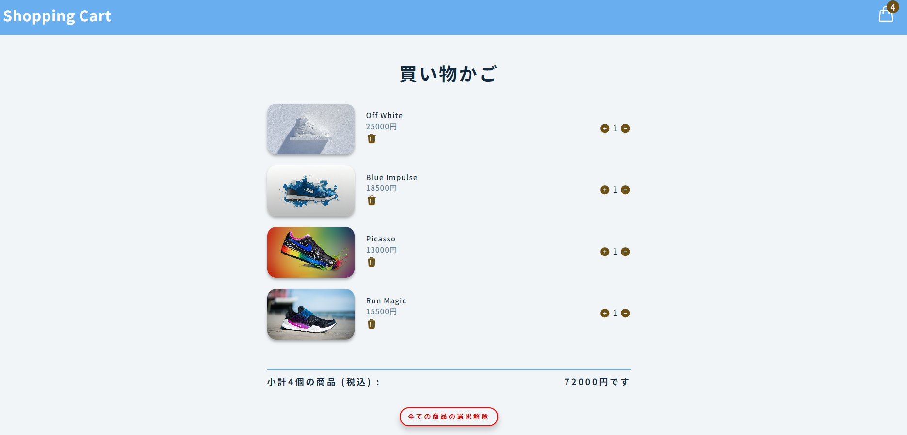

# Redux を使ってショッピングカートアプリを作成

Reduxはアプリケーション全体の状態を管理するためのシステム  
ReduxToolkitはReduxを使った開発を簡単にするためのツール  
HooksはReduxの状態にアクセスしたり、Reduxを通じてアクションをディスパッチしたりするためのインターフェースを関数コンポーネントに提供する

## Redux を使用した状態管理

Redux を使うことでコンポーネント間で状態を共有しやすくなるが、設定やボイラープレート（繰り返し書くコード）が多いというデメリットもある。

## Redux Toolkit の基礎

Reduxの設定、アクションの定義、リデューサーの作成などに関するボイラープレートを減らし、効率的な開発ができる。
ReduxToolkitを使うことで、Reduxの強力な状態管理機能をよりシンプルにできる。

## Hooks

関数コンポーネント内で状態やライフサイクルなどのReactの機能を使うためのAPI。  
useStateやuseEffectなどのHooksを使うことで、クラスコンポーネントを使わずに状態管理や副作用の処理が可能になる。  
Reduxと組み合わせることでuseSelectorやuseDispatchといったHooksを通じてReduxの状態を操作したり、アクションをdispatchできる。
